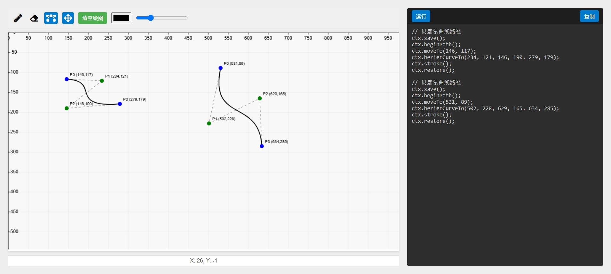

# canvas_helper

#### 介绍
canvas学习助手
我在学习到贝塞尔曲线的时候,想使用贝塞尔曲线去画一些图形,组件时,发现有点困难,所以我就写了这个canvas_helper,希望能帮助到大家,也希望大家能多多支持我,谢谢!

#### 软件架构
软件架构说明

#### 安装教程

1.  无需安装
2.  打开后直接访问index.html
3.  xxxx

#### 使用说明

点击画笔或者贝塞尔曲线可以直接在画布上面绘制图形,点击拖拽按钮可以变更贝塞尔曲线位置和控制点的位置

#### 参与贡献

1.  Fork 本仓库
2.  新建 Feat_xxx 分支
3.  提交代码
4.  新建 Pull Request

#### 特技

1.  使用 Readme\_XXX.md 来支持不同的语言，例如 Readme\_en.md, Readme\_zh.md
2.  Gitee 官方博客 [blog.gitee.com](https://blog.gitee.com)
3.  你可以 [https://gitee.com/explore](https://gitee.com/explore) 这个地址来了解 Gitee 上的优秀开源项目
4.  [GVP](https://gitee.com/gvp) 全称是 Gitee 最有价值开源项目，是综合评定出的优秀开源项目
5.  Gitee 官方提供的使用手册 [https://gitee.com/help](https://gitee.com/help)
6.  Gitee 封面人物是一档用来展示 Gitee 会员风采的栏目 [https://gitee.com/gitee-stars/](https://gitee.com/gitee-stars/)
